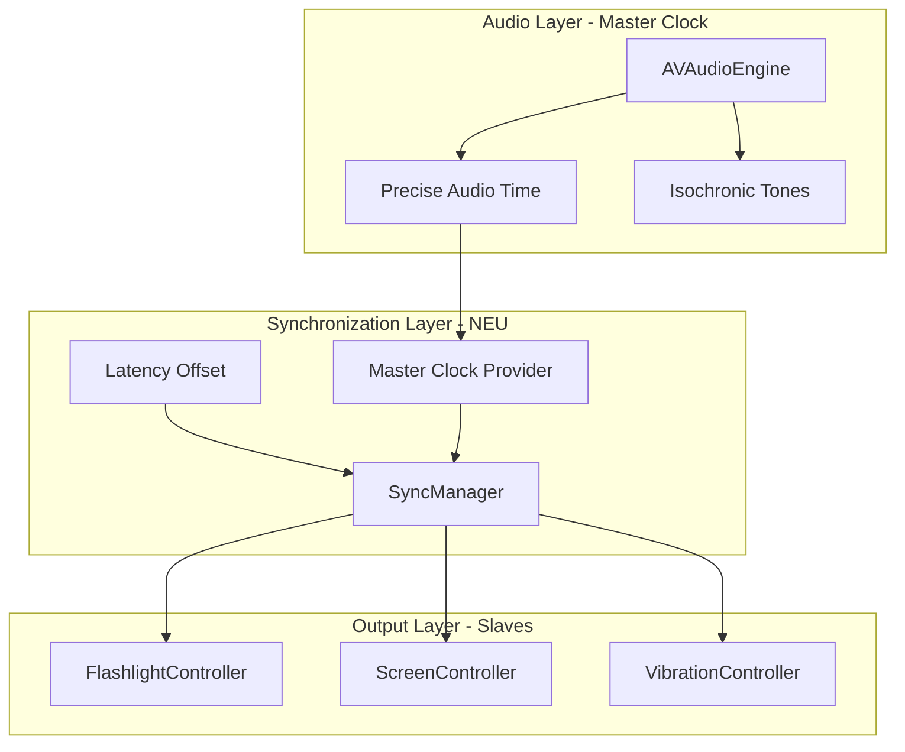

# MindSync Herzstück-Optimierung: Synchronisierung und Hardware-Kompensation

## Analyse-Zusammenfassung

Nach gruendlicher Pruefung des Codes kann ich Geminis Analyse groesstenteils bestaetigen, muss aber einige Punkte differenzieren:

### Geminis Punkte - Validierung:

| Problem | Geminis Einschaetzung | Meine Analyse ||---------|----------------------|---------------|| Bluetooth-Latenz | **Kritisch** | **Bestaetigt** - Keine Kompensation vorhanden || Flashlight 40Hz | **Kritisch** | **Teilweise** - SafetyLimits begrenzt auf 30Hz, aber Duty-Cycle fehlt || BeatDetector reaktiv | **Wichtig** | **Differenziert** - Pre-Analyse ist OK, aber Mikrofon-Modus ist problematisch || Timer-Praezision | **Wichtig** | **Bestaetigt** - CADisplayLink ist gut, aber nicht audio-synchron |

### Zusaetzliche Probleme:

1. **Keine echte Clock-Synchronisation** zwischen AVAudioEngine, CADisplayLink und CHHapticEngine
2. **Kein Latency-Offset** fuer Bluetooth-Audio in UserPreferences
3. **Duty-Cycle** nicht frequenzabhaengig angepasst
4. **CADisplayLink stoppt im Hintergrund** - Audio laeuft weiter

---

## Phase 1: Bluetooth-Latenz-Kompensation (Kritisch)

### 1.1 UserPreferences erweitern

In [`MindSync/Models/UserPreferences.swift`](MindSync/Models/UserPreferences.swift):

```swift
// Neue Property fuer Audio-Latenz-Kompensation (in Sekunden)
var audioLatencyOffset: TimeInterval  // 0.0 - 0.5 Sekunden
```


### 1.2 Latenz-Kalibrierungs-View erstellen

Neuer Screen im Onboarding oder Settings, der:

- Einen Ton abspielt und gleichzeitig das Display blitzt
- User tippt, wenn beide synchron erscheinen
- Misst die Differenz und speichert `audioLatencyOffset`

### 1.3 Light-Controller Offset anwenden

In [`MindSync/Core/Light/BaseLightController.swift`](MindSync/Core/Light/BaseLightController.swift):

```swift
// Offset von User-Praeferenzen anwenden
let adjustedElapsed = realElapsed - audioLatencyOffset
```

Das Licht muss **verspaetet** werden, damit es gleichzeitig mit dem Audio beim User ankommt.---

## Phase 2: Flashlight Duty-Cycle Optimierung

### 2.1 Frequenzabhaengigen Duty-Cycle einfuehren

In [`MindSync/Core/Light/FlashlightController.swift`](MindSync/Core/Light/FlashlightController.swift):

```swift
private func calculateDutyCycle(for frequency: Double) -> Double {
    // Bei hohen Frequenzen (>20Hz): kuerzere An-Zeit fuer schaerfere Blitze
    if frequency > 20.0 {
        return 0.2  // 20% an, 80% aus
    } else if frequency > 10.0 {
        return 0.35  // 35% an
    }
    return 0.5  // Standard 50%
}
```


### 2.2 Square-Wave mit reduziertem Duty-Cycle

Die `calculateIntensity` Methode anpassen:

```swift
case .square:
    let period = 1.0 / targetFrequency
    let dutyCycle = calculateDutyCycle(for: targetFrequency)
    let phase = timeWithinEvent.truncatingRemainder(dividingBy: period) / period
    return phase < dutyCycle ? event.intensity : 0.0
```

---

## Phase 3: Audio-Licht-Synchronisation verbessern

### 3.1 Audio-basierte Master-Clock

Statt CADisplayLink als unabhaengige Clock zu nutzen, sollte das Timing vom Audio abgeleitet werden:**Option A: AVAudioPlayerNode Time Reference (Empfohlen)**In [`MindSync/Services/AudioPlaybackService.swift`](MindSync/Services/AudioPlaybackService.swift):

```swift
/// Praezise Audio-Zeit in Sekunden (vom Audio-Thread)
var preciseAudioTime: TimeInterval {
    guard let node = playerNode, let file = audioFile else { return 0 }
    guard let nodeTime = node.lastRenderTime,
          let playerTime = node.playerTime(forNodeTime: nodeTime) else {
        return currentTime  // Fallback
    }
    return Double(playerTime.sampleTime) / playerTime.sampleRate
}
```


### 3.2 Light-Controller mit Audio-Zeit synchronisieren

Die Light-Controller sollten `audioPlayback.preciseAudioTime` nutzen statt `Date().timeIntervalSince(startTime)`.---

## Phase 4: ~~Mikrofon-Modus Latenz-Reduktion~~ (ENTFERNT)

**Status:** Phase 4 wurde entfernt, da der Mikrofon-Modus vollständig aus der App entfernt wurde.---

## Phase 5: Robustheit und Edge Cases ✅

### 5.1 Background-Handling ✅

**Implementiert:**

- `UIApplication.shared.isIdleTimerDisabled = true` wird bei Session-Start gesetzt
- Verhindert, dass der Screen ausgeht während einer Session
- Wird bei Session-Stop wieder zurückgesetzt
- App pausiert automatisch im Hintergrund (bereits vorhanden)

**Dateien geändert:**

- `MindSync/Features/Session/SessionViewModel.swift`

### 5.2 Konsistente Wellenform ueber alle Modalitaeten ✅

**Implementiert:**

- `WaveformGenerator` erweitert um:
- `dutyCycle` Parameter für Square-Wave (FlashlightController-spezifisch)
- `calculateVibrationIntensity()` für Vibration-Waveforms
- Alle Controller nutzen jetzt `WaveformGenerator`:
- `FlashlightController`: Nutzt frequenzabhängigen Duty-Cycle
- `ScreenController`: Nutzt Standard-Duty-Cycle (50%)
- `VibrationController`: Nutzt Vibration-spezifische Methode

**Vorteile:**

- Konsistente Wellenform-Berechnung
- Weniger Code-Duplikation
- Einfacher zu warten und zu testen

**Dateien geändert:**

- `MindSync/Core/Entrainment/WaveformGenerator.swift`
- `MindSync/Core/Light/FlashlightController.swift`
- `MindSync/Core/Light/ScreenController.swift`
- `MindSync/Core/Vibration/VibrationController.swift`---

## Architektur-Diagramm



---

## Implementierungs-Prioritaeten

| Prioritaet | Task | Status | Aufwand | Impact ||------------|------|--------|---------|--------|| 1 - Kritisch | Bluetooth-Latenz-Offset in UserPreferences | ✅ **Fertig** | Niedrig | Hoch || 1 - Kritisch | Latenz-Offset in Light-Controllern anwenden | ✅ **Fertig** | Niedrig | Hoch || 2 - Hoch | Latenz-Kalibrierungs-UI | ✅ **Fertig** | Mittel | Hoch || 2 - Hoch | Frequenzabhaengiger Duty-Cycle | ✅ **Fertig** | Niedrig | Mittel || 3 - Mittel | Audio-basierte Master-Clock | ✅ **Fertig** | Hoch | Hoch || 3 - Mittel | Wellenform-Berechnung zentralisieren | ✅ **Fertig** | Mittel | Niedrig || 5 - Mittel | Background-Handling (isIdleTimerDisabled) | ✅ **Fertig** | Niedrig | Mittel |---

## Implementierungs-Status

**Alle kritischen und wichtigen Tasks sind abgeschlossen! ✅**

- ✅ Phase 1: Bluetooth-Latenz-Kompensation
- ✅ Phase 2: Flashlight Duty-Cycle Optimierung
- ✅ Phase 3: Audio-Licht-Synchronisation verbessern
- ✅ Phase 5: Robustheit und Edge Cases
- ❌ Phase 4: Entfernt (Mikrofon-Modus entfernt)

## Dateien, die geaendert werden

1. [`MindSync/Models/UserPreferences.swift`](MindSync/Models/UserPreferences.swift) - Latency-Offset Property
2. [`MindSync/Core/Light/BaseLightController.swift`](MindSync/Core/Light/BaseLightController.swift) - Offset anwenden